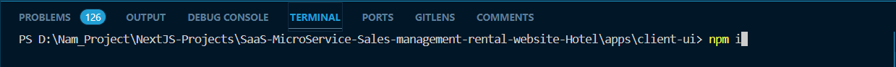
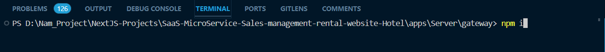
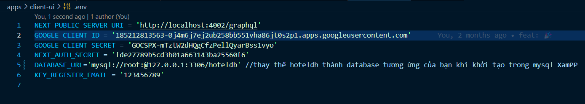

# Hotel Chain Management WebSite using Nest.js, GraphQL, Next.js, Prisma, SlimPHP

Welcome to our Welding Store Hotel chain management open source website, the goal of this project is to create a project to manage rooms as well as goods and inventory. Rights will be divided between Admin and Receptionist. All project folders will be freely accessible, and the Readme file at the top is the initialization file intended to introduce the website.

## How to set up the environment

### Client site

Step 1: Open a new Terminal from the root folder and type the command: cd/apps/client-ui

Step 2: Type command: npm i as below

Step 3: Next, follow [Client_ReadMe](https://github.com/DoNhatNam1/SaaS-MicroService-Sales-management-rental-website/blob/Hotel_Branch/apps/client-ui/README.md)

### Server site

B1: Open a new Terminal from the root folder and type the command: cd/apps/Server/gateway

B2: Type command: npm i as below

B3: Next, follow [Server_ReadMe](https://github.com/DoNhatNam1/SaaS-MicroService-Sales-management-rental-website/blob/Hotel_Branch/apps/Server/gateway/README.md) 

### Note: 

Remember to pre-install NodeJS on the device and open both cmd client and server to launch the project.

Remember to replace the configs in the .env file of both client-ui and Server folders to match your database.

